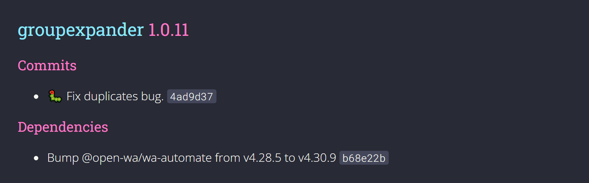

<div align="center">


<h5>WhatsApp group expanding to bypass WhatsApp's group size limit.</h5>


</div>

## Latest Changes

<div align="center">
   
   </div>

Always wanted to have more than 256 participants in your group? (well 257 if you use the invite "hack"), Well this bot is just for you!

This little bot can forward all of your messages from one group to another and add the participants names to the message so you can message members on the other group as if they were in the same group.

## Commands

Command pattern used for easy management of adding more commands.

- ### Forwarder ⏩:
  - Add and remove forwarders via chat commands. 
  - Add and remove group for every forwarder. (more information below) 

- ### Owner 👑:
  - Kick 🦶 all participants from group. (must add the following text after the command: `I understand that this command will kick everyone`)
  - Get a list of names from a specific group.
  - Get all group IDs of the groups sent to owner.
  - Spam-tag someone to get their attention.

- ### Admin 💼:
  - Tag everyone in the group.
  - Kick 🦶 a participant from group.
  
## To Do
Feature | Done 
--- | --- |   
Forward all types of messages | ✔ 
Auto delete older messages | ✔ 
Delete forwarded message if the real message got deleted | ❌
MongoDB | ❌

## Dependencies
- [node.js](https://nodejs.org/en/download/) >= v14.16.0
- [npm]() >= v7.15.1
- [wa-automate](https://github.com/open-wa/wa-automate-nodejs) >= v4.17.1


## Installation

clone the project:
```
git clone https://github.com/eyalmichon/GroupExpander.git
```
then inside the project folder use the following command to install required packages:
```
npm install
```
Next, make sure all of the dependencies are installed.

Go into `handler\util` and create a `config.json` file. inside you should put you number like so:
```json
{
  "botMaster":"PHONE_GOES_HERE"
}
```

Now, inside index.js change `executablePath` path in the options to where you've installed chrome OR try the `useChrome` option and it may guess the location corretly.

## Usage

### The Forwarder:

Each Forwarder has the following properties:
- Array of groups: the groups that the forwarder is going to forward the messages to.
- Language: the language of the used prefix message. (if set to true)
- Prefix name and message: a boolean for setting if the forwarder should forward the messages with a prefix message before the actual message or with the name of the sender before the actual message.

### How to get started:
1. Add the bot into the group you want to become a forwarder.
2. Send the following command to the bot's chat: `id`, you'll get all the chat IDs for each group.
3. Use the following command inside the group: `!addforwader eng` (where eng is for english and can be switched to the other languages that are in the localizations.json file) OR in the bot's chat: `!addforwader *******@g.us eng` (where `*******@g.us` is taken from 2) (only the ownder can use this command).
4. To add groups into the forwarder use the following command inside the forwarder: `addgf *******@g.us` (where `*******@g.us` is the group you want the forwarder to forward messages to) OR in the bot's chat: `!addgf *******@g.us *******@g.us` (where the first group ID is the forwarder's and the second is the group you want to add)
5. Removing a forwarder is as simple as using the command `!rmforwarder` inside the forwarder OR in the bot's chat: `!rmforwarder *******@g.us` and for removing a group it'll be: `!rmgf *******@g.us` (where the group ID is the group you want removed) inside the forwarder that has this group OR inside the bot's chat: `!rmgf *******@g.us *******@g.us` (where the first group ID is the forwarder's and the second is the group you want to remove)
6. Changing the language of the group: `!slf lang` inside the forwader OR in the bot `!slf *******@g.us lang`.
7. Each group will save an infinite amount of messages on default, if you want to change that you can use the `!smmf` command in the following manner: `!smmf n` inside the forwarder OR in bot's chat: `!smmf *******@g.us n` (where n is the max number of messages you want the forwarder to save in the DB).
8. Changing the the boolean for prefix/name in prefix message: `!spf -p/-prefix/-n/-name` OR in bot's chat: `!spf *******@g.us -p/-prefix/-n/-name` (where p/prefix flags are for prefix message and -name/-n is for name in prefix message).


## Running

```
npm start
```
scan the QR code and wow, you're done!
